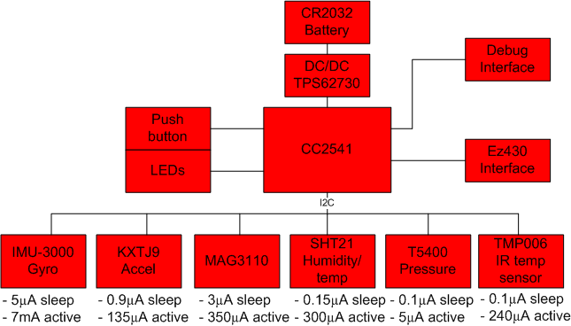
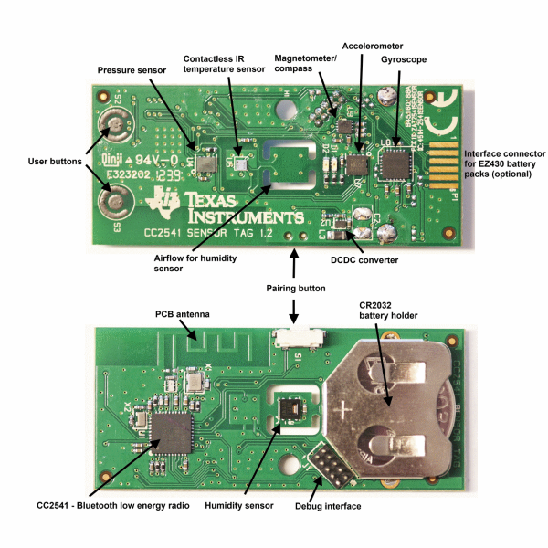

# Working with SensorTags

A small sample using the SensorTag from Texas Instruments in conjunction with the Raspberry Pi 3. In this tutorial we concentrate on the CC2540, even though most things would also work on the CC2650.


## Overview

In this sample we will work with a SensorTag and a Rasperry Pi 3. The target is to understand the interaction between the SensorTag and the Raspbery Pi 3 via Bluetooth Low Energy (BTLE). The Raspberry Pi 3 was chosen as it comes with an on-board Bluetooth chip.

## Requirements

In order to fully cover this tutorial we need the following setup:

* A Raspberry Pi 3
* A TI SensorTag (CC2540 or CC2650)
* WiFi or Ethernet connection to the Rapsberry Pi
* A proper OS on the Raspberry Pi 3 (incl. a proper development setup and Bluetooth)
* A connection via SSH to the Raspberry Pi

We can use an editor installed on the Raspberry Pi 3, e.g., nano, ed, or vim. The tutorial uses the *Raspbian Jessie* image on the Raspberry Pi 3. This one should come with the Bluetooth drivers, otherwise try executing the following command:

```bash
sudo apt-get install pi-bluetooth
```

## Step-By-Step

We start by setting up the hardware environment. The software should be all pre-configured, especially if we choose to take one of the available images.

### Playing with Bluetooth from the Command Line

Connect to the Raspberry Pi with your favorite SSH client (e.g., Putty from Windows). In the shell you can now play around using the following instructions:

1. Run the standard Bluetooth program (should come with the OS) by typing `bluetoothctl`.
2. Turn on the Bluetooth, if not already on, by typing `power on`. Similarly, the power can be turned off with `power off`.
3. Use the `devices` command to list the paired devices.
4. Enter the device discovery mode with the `scan on` command. After some time the SensorTag should appear (let's say with the MAC address 34:B1:F7:D4:F2:CF).
5. Enter `pair 34:B1:F7:D4:F2:CF` to create the pairing between the Pi and the SensorTag.
6. Now we can stop discovering devices with `scan off`.
7. Exit the program by typing `exit`.

This way we discovered and paired our device. Now we can use the `gatttool` to play around with values.

1. Run the program by typing `gatttool -b 34:B1:F7:D4:F2:CF --interactive`. We enter an interactive session.
2. The first command we issue is `connect`. We should see a "Connection successful" message.
3. Now we can try to read from the SensorTag: `char-read-hnd 0x25` uses the handle 0x25 to read data from the thermometer. We should see some zeros.
4. To read some values we need to turn on the thermometer. We issue `char-write-cmd 0x29 01` to turn the thermometer sensor at 0x29 on.
5. Issuing the command `char-read-hnd 0x25` again should now yield a non-zero value.
6. Exit the program by typing `exit`.

If something does not work until now we potentially need to turn on Bluetooth Low Energy:

```bash
rfkill unblock bluetooth
hciconfig hci0 up
```

In some rare cases (e.g., on the Intel Edison) this alone may not do the job. A temporary fix could be to use the following command

```bash
killall bluetoothd
```

between using the `rfkill` and `hciconfig` executables. If the temporary fix is working correctly we can turn it into a permanent fix by replacing the command above with the following command:

```bash
systemctl disable bluetooth
```

Now the Bluetooth communication should be stable and reliable.

To learn what exactly we did we need to get to know the so-called *handles* available on the SensorTag.

### Handles

The SensorTag comes with a lot of different sensors. This includes:

* Contactless IR temperature sensor (Texas Instruments TMP006)
* Humidity Sensor (Sensirion SHT21)
* Gyroscope (Invensense IMU-3000)
* Accelerometer (Kionix KXTJ9)
* Magnetometer (Freescale MAG3110)
* Barometric pressure sensor (Epcos T5400)
* On-chip temperature sensor (Built into the CC2541)
* Battery/voltage sensor (Built into the CC2541)

Turning the different sensors on or off has an impact on the power consumption. The following image illustrates the different power requirements.



The following table gives a short overview on some of the previously mentioned sensors.

| Sensor              | Read | Length  | Conf | Data |
| ------------------- | ---- | ------- | ---- | ---- |
| IR Temperature      | 0x25 | 4 bytes | 0x29 | 0x26 |
| Accelerometer       | 0x2d | 3 bytes | 0x31 | 0x2e |
| Humidity            | 0x38 | 4 bytes | 0x3c | 0x39 |
| Magnetometer        | 0x40 | 6 bytes | 0x44 | 0x41 |
| Barometric Pressure | 0x4b | 4 bytes | 0x4f | 0x4c |
| Gyroscope           | 0x57 | 6 bytes | 0x5b | 0x58 |

The barometric pressure sensor also requires an extra calibration. The calibration has to be done before the first measurement. The following steps are required:

1. We issue the command `char-write-cmd 0x4f 02`. This performs the calibration.
2. The device is now read via `char-read-hnd 0x52` yielding the raw value.

Overall, the following image shows a nice map of the sensor components placed over the SensorTag board.



### Bluetooth with C

Now we switch gears and use C in conjunction with `libbluetooth-dev`, which is the BlueZ library. This library provides us with everything we need to use Bluetooth from C without friction. Programming bluetooth using BlueZ feels a bit like network programming using sockets. The previously used tool `bluetoothctl` was programmed using this library.

In order to read and write values we used the `gatttool`. The Generic Attribute Profile (GATT) is the Bluetooth Profile that BLE devices will use to communicate with each other. Here, data is organized into nested objects called profiles, services, and characteristics.

Before we continue let's review what we are about to do via the GATT. It all boils down to:

* Use the device, e.g., `34:B1:F7:D4:F2:CF`
* Connect to the device
* Enable the sensor, e.g., writing 1 to `0x29`
* Read the sensor, e.g., reading from `0x25`
* Disable the sensor, e.g., writing 0 to `0x29`
* Disconnect from the device

We could poll the sensor(s), e.g., every second. The following code is required to scan for devices using the BlueZ library.

```c
#include <stdio.h>
#include <stdlib.h>
#include <unistd.h>
#include <sys/socket.h>
#include <bluetooth/bluetooth.h>
#include <bluetooth/hci.h>
#include <bluetooth/hci_lib.h>

int main(int argc, char **argv)
{
    char addr[19] = { 0 };
    char name[248] = { 0 };
    int dev_id = hci_get_route(NULL);
    int sock = hci_open_dev(dev_id);

    if (dev_id < 0 || sock < 0) {
        perror("opening socket");
        exit(1);
    }

    int len = 8;
    int max_rsp = 255;
    int flags = IREQ_CACHE_FLUSH;
    inquiry_info *ii = (inquiry_info*)malloc(max_rsp * sizeof(inquiry_info));    
    int num_rsp = hci_inquiry(dev_id, len, max_rsp, NULL, &ii, flags);

    if (num_rsp < 0) {
        perror("hci_inquiry");
    }

    for (int i = 0; i < num_rsp; i++) {
        ba2str(&(ii+i)->bdaddr, addr);
        memset(name, 0, sizeof(name));

        if (hci_read_remote_name(sock, &(ii+i)->bdaddr, sizeof(name), name, 0) < 0) {
            strcpy(name, "[unknown]");
        }

        printf("%s  %s\n", addr, name);
    }

    free(ii);
    close(sock);
    return 0;
}
```

The basic data structure used to specify a Bluetooth device address is the `bdaddr_t`. All Bluetooth addresses in BlueZ will be stored and manipulated as `bdaddr_t` structures. BlueZ provides two convenience functions to convert between strings and bdaddr_t structures: `str2ba` and `ba2str`. `str2ba` takes a string of the form `"XX:XX:XX:XX:XX:XX"`, where each *XX* is a hexadecimal number specifying an octet of the 48-bit address, and packs it into a 6-byte `bdaddr_t`. `ba2str` does exactly the opposite.

The bare minimum to compile the given source code with the GCC compiler is given below. Besides specifying an appropriate output name and placing the input name we also have to link against `libbluetooth`.

```bash
gcc -o sample sample.c -lbluetooth
```

Finally, to send a command using the BlueZ library we need the following function:

```c
int hci_send_cmd(int sock, uint16_t ogf, uint16_t ocf, uint8_t plen, void *param);
```

This is quite powerful stuff, but rarely practical. Luckily, we are not constrained by hardware here such that using an abstraction such as Node.js is possible. In the following we go into a few details when using JavaScript with the Node.js library *Noble*.

### Bluetooth with Node.js

For developing Bluetooth with Node.js we use the Noble library. This one is essentially a wrapper around BlueZ providing a JavaScript-ish API that is - of course - asynchronous. The following three packages may be required, where the last one is definitely required to follow this tutorial:

```bash
npm install bluetooth-hci-socket
npm install noble
npm install noble-device
```

Before doing anything with Noble we should give Node.js the `cap_net_raw` privileges, so it can start/stop BLE advertising. Advertising may not be required (after all in this tutorial we are mainly concerned to model a Bluetooth host) in our case, but in general it is quite an interesting activity. It makes connection to smartphones - which act themselves as hosts already - possible.

```bash
sudo setcap cap_net_raw+eip $(eval readlink -f `which node`)
```

Let's start by using noble device for interaction with BTLE to connect and obtain information about some Bluetooth device. We need the following import call.

```js
const NobleDevice = require('noble-device');
```

Now we can go into discovery mode, which looks for devices to be pair-able. This is simple:

```js
NobleDevice.discoverAll(device => { 
  // We found a new device!
});
```

If we use Noble directly we could issue the same thing by starting the scanning procedure. Additionally we should listen to the discover event.

```js
noble.startScanning([], false); // UUIDs, duplicates
noble.on('discover', peripheral => {
  // We found a new peripheral (this is lower-level than device)!
});
```

Note that the peripheral forms the basis for the device we obtain using the `noble-device` abstraction layer.

With the detected device we can do a lot of things, but most importantly we can start the pairing process by connecting to the device. In Noble there is a specific function to trigger this functionality. The `connect` method of the peripheral obtained above performs the pairing process. However, the `noble-device` abstraction layer also introduces the even more handy function `connectAndSetUp`. Essentially, it boils down to the following chain of calls:

```js
device.connect(err => {
  if (err) {
    return callback(error);
  }
    
  this.discoverServicesAndCharacteristics(() => callback());
});
```

Hence we either connect successfully and continue with a service and characteristic discovery of the device, or we end with an error in the pairing process.

Now that we are paired we can do something useful with the CC2540. Reading the accelerometer requires using the following constants:

```js
const ACCELEROMETER_UUID = 'f000aa1004514000b000000000000000';
const ACCELEROMETER_DATA_UUID = 'f000aa1104514000b000000000000000';
const ACCELEROMETER_CONFIG_UUID = 'f000aa1204514000b000000000000000';
const ACCELEROMETER_PERIOD_UUID = 'f000aa1304514000b000000000000000';
```

we see that these are strings representing hexadecimal numbers. They all share a common prefix (`f000aa1`) and end with the same sequence(`04514000b000000000000000`). These Universally Unique Identifiers (UUIDs) can be used to directly obtain sensor readings via the Noble library. How does it work? Let's suppose we want to enable or disable reading from the accelerometer. We first need to discover the device. Now let's pretend that `device` refers to a discovered SensorTag device.

We can call the `writeUInt8Characteristic` method with a value of `0x1` to enable reading the accelerometer:

```js
device.writeUInt8Characteristic(ACCELEROMETER_UUID, ACCELEROMETER_CONFIG_UUID, 0x1, () => {
  // once enabled
});
```

Similarly, we can use a value of `0x0` to disable the accelerometer:

```js
device.writeUInt8Characteristic(ACCELEROMETER_UUID, ACCELEROMETER_CONFIG_UUID, 0x0, () => {
 // once disabled
});
```

How can we now use this to read the current value of the accelerometer? This is where the `readDataCharacteristic` method shines:

```js
device.readDataCharacteristic(ACCELEROMETER_UUID, ACCELEROMETER_DATA_UUID, (error, data) => {
  if (error) {
    return callback(error);
  }

  callback(null, { 
    x: data.readInt8(0) / 16.0, 
    y: data.readInt8(1) / 16.0, 
    z: data.readInt8(2) / 16.0 
  });
});
```

Finally, we also have the ability to set a certain poll-period on the device. For this we use the dedicated UUID together with the period. The period should be at least 1 and at most 255. A unit of the period is 10ms, i.e., if we pass the period in milliseconds we still need to divide by 10 to obtain the number of periods for the SensorTag device:

```js
device.writeUInt8Characteristic(ACCELEROMETER_UUID, ACCELEROMETER_PERIOD_UUID, period / 10, callback);
```

That was easy! However, there is an even simpler way to access the SensorTag from Node.js ...

### SensorTag Library for Node.js

The whole process we have just looked at is already embedded in a small Node.js library called `node-sensortag`. The library uses `noble-device` and pretty much follows the steps we've just discussed. Furthermore, it already implemented all processes / UUIDs that are available on the CC2540 and CC2650!

Using it is as easy as the following example:

```js
const SensorTag = require('sensortag');

SensorTag.discover(tag => {
  console.log('Discovered new SensorTag!');

  tag.on('disconnect', () => {
    console.log('Disconnected!');
    process.exit(0);
  });  

  tag.connectAndSetUp(() => {
    console.log('Connected!');
    tag.enableAccelerometer(() => {
      tag.notifyAccelerometer(() => {
        tag.on('accelerometerChange', (x, y, z) => {
          console.log('Accelerometer reading: x = %d, y = %d, z = %d',
            x.toFixed(1),
            y.toFixed(1),
            z.toFixed(1));
        });
      });
    });
  });
});
```

In the example we connect to the first discovered SensorTag (works independently of CC2540/CC2650). Then we enable the accelerometer. Finally, we want to be notified once the reading changes. The readings are then displayed in the console.

## Conclusions

Using Bluetooth on the Raspberry Pi (or any other device for that matter) is rather simple with the right tools. One should either use the previously mentioned command line tools (potentially orchestrated using Bash) or do it the easy way with an abstraction layer such as Node.js or Python.

In this tutorial we looked at the `noble-device` abstraction layer, which is yet another higher-level way of accessing the Noble library. Finally, we had the pleasure of looking at the most simple way of working with a specific Bluetooth device: A library written only for the purpose of abstracting the communication and low-level details of the device away from the developer.

## References

* [Raspbian Image Download](https://www.raspberrypi.org/downloads/raspbian/)
* [Raspberry Pi and TI CC2541 SensorTag](http://mike.saunby.net/2013/04/raspberry-pi-and-ti-cc2541-sensortag.html)
* [Raspberry Pi 3 - How to Configure Wi-Fi and Bluetooth](https://www.maker.io/en/blogs/raspberry-pi-3-how-to-configure-wi-fi-and-bluetooth/03fcd2a252914350938d8c5471cf3b63)
* [SensorTag User Guide](http://processors.wiki.ti.com/index.php/SensorTag_User_Guide)
* [Bluetooth Programming](https://people.csail.mit.edu/albert/bluez-intro/c404.html)
* [BlueZ Experiments](https://github.com/carsonmcdonald/bluez-experiments)
* [Noble](https://github.com/sandeepmistry/noble)
* [Noble-Device](https://github.com/sandeepmistry/noble-device)
* [Node-SensorTag](https://github.com/sandeepmistry/node-sensortag)
* [Configuration of the Intel Edison for BTLE](http://rexstjohn.com/configure-intel-edison-for-bluetooth-le-smart-development/)